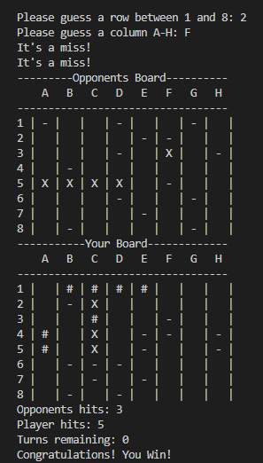
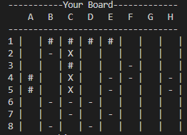
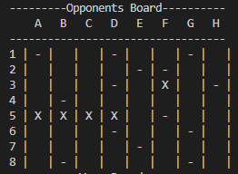
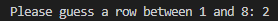
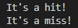
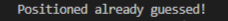
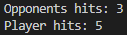

# Battle-Ship Game

The Battle-ship Game is a logic game that most people are familiar with that runs in the command-line interface. It allows a single user to play an opponent (computer) in the game of Battle_ship.

## Features
### Game board display
The game displays both a player board and and opponent board.
<ol>
 <li>
  Player Board
   <ul>
   
    <li>
     The board is made up as a grid with rows labelled 1-8 and columns labelled A-H, This allows the user to see and determine where they want to strike.
    </li>
    <li>
     It displays the position of the users randomly placed ships with the "#" symbol.
    </li>
    <li>
     Shows the user where the opponent has already guessed, misses are displayed with a "-" symbol and hits are displayed with a "X" symbol.
    </li>
   </ul>
 </li>
 <li>
  Opponent Board
 </li>
  <ul>
  
   <li>
    The Opponent board is created in the same way as the player board, the only difference is the random generated ships are hidden from the user.
   </li>
   <li>
    The board shows the user where they have guessed displaying a "-" symbol for a miss and a "X" symbol for a hit.
   </li>
  </ul>
</ol>

### User Inputs
There are 2 user inputs for the game, 1 for row selection and the other for column selection.
<ol>
 <li>
  Row Input
  <ul>
  
   <li>
    When the game is ran a row selection input is printed in the console for the user to type their selection.
   </li>
  </ul>
 </li>
 <li>
  Column Input
  <ul>
  
   <li>
    When the row selection has been made a column selection input is printed in the console for the user to type their selection.
   </li>
  </ul>
 </li>
</ol>
When both selections have been made the game will check to see if it's a hit or miss and the display whuch it is on the opponent board.

### Selection Outcome Display

When the player has made a selection of where to strike the game will display "It's a miss!", "It's a hit!" or "Positioned already guessed!" for both the player and the opponent.

### Hits counters

When the game is ran it will display a hit counter for both the player and the opponent so the player can see who has more hits at any given time during the game.

### Turns Counter

When the game is ran it will display a turns counter, this counter with start at the number of turns a player has and will show how many turns the player has remaining throughout the game.