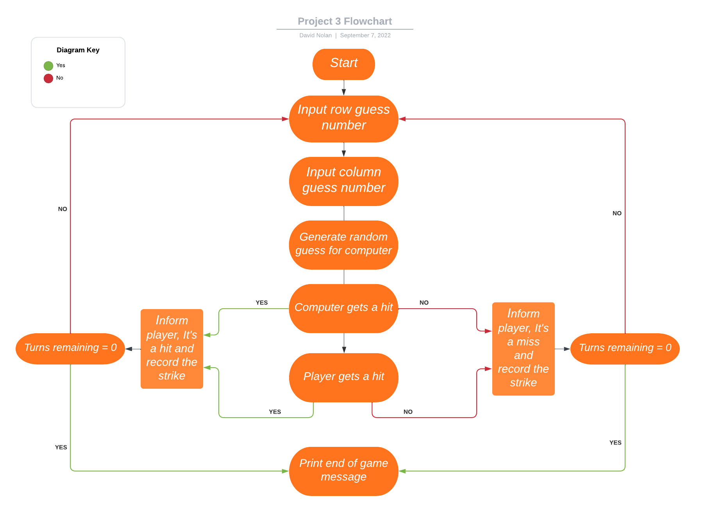
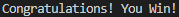
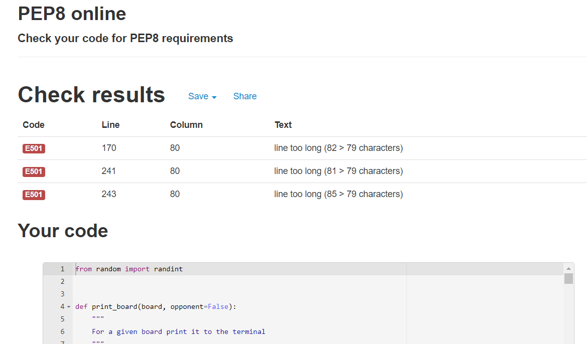
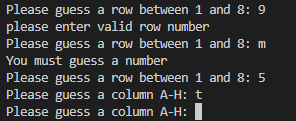
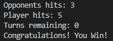

# Battle-Ship Game

The Battleship Game is a logic game that most people are familiar with that runs in the command-line interface. It allows a single user to play an opponent (computer) in the game Battle_ship.

## UX
### Ideal Client
The ideal client for this page is anyone that wants to pass some time in a fun way.
#### They would ideally:
<ul>
    <li>Someone who is impulsive.</li>
    <li>Has some time to spare.</li>
    <li>Is a logical thinker.</li>
    <li>Enjoys making tactical decisions to achieve the desired outcome.</li>
</ul> 

#### Goal as a Game User:
<ul>
    <li>Understand the game.</li>
    <li>Be able to easily operate the game and its functions.</li>
    <li>Be able to see their score as well as the opponent's.</li>
</ul>

## Design
I mapped out what I wanted to achieve with my functions on a flowchart

## Languages Used
The only language used in this project was Python.

## Features

## Existing Features

### Game board display
The game displays both a player board and an opponent board.
<ol>
 <li>
  Player Board
   <ul>
   
    <li>
     The board is made up of a grid with rows labelled 1-8 and columns labelled A-H, This allows the user to see and determine where they want to strike.
    </li>
    <li>
     It displays the position of the user's randomly placed ships with the "#" symbol.
    </li>
    <li>
     Shows the user where the opponent has already guessed, misses are displayed with a "-" symbol and hits are displayed with an "X" symbol.
    </li>
   </ul>
 </li>
 <li>
  Opponent Board
 </li>
  <ul>
  
   <li>
    The Opponent board is created in the same way as the player board, the only difference is the randomly generated ships are hidden from the user.
   </li>
   <li>
    The board shows the user where they have guessed displaying a "-" symbol for a miss and an "X" symbol for a hit.
   </li>
  </ul>
</ol>

### User Inputs
There are 2 user inputs for the game, 1 for row selection and the other for column selection.
<ol>
 <li>
  Row Input
  <ul>
  
   <li>
    When the game is run a row selection input is printed in the console for the user to type their selection.
   </li>
  </ul>
 </li>
 <li>
  Column Input
  <ul>
  
   <li>
    When the row selection has been made a column selection input is printed in the console for the user to type their selection.
   </li>
  </ul>
 </li>
</ol>
When both selections have been made the game will check to see if it's a hit or miss and the display which it is on the opponent board.

### Selection Outcome Display

When the player has made a selection of where to strike the game will display "It's a miss!", "It's a hit!" or "Positioned already guessed! Annnd you've wasted a turn!" for both the player and the opponent.

### Hits counters

When the game is running it will display a hit counter for both the player and the opponent so the player can see who has more hits at any given time during the game.

### Turns Counter

When the game is running it will display a turns counter, this counter with start at the number of turns a player has and will show how many turns the player has remaining throughout the game.

### End of game message

When a player has used all of their turns a message will be printed to the console stating "Congratulations! You Win!", "You Lose!, Better luck next time." or "It's a Draw, Try again" depending on the outcome of the game.

## Possible Features to be implemented in the future:
<ul>
 <li>
  Allow the user to input grid size.
 </li>
 <li>
  Allow the user to input ship sizes, this can be easily achieved as the ships variable is easily changed and could be done with a function containing an input for the user to enter the ship values.
 </li>
 <li>
  Allow the user to input the number of turns the game runs for, again this can be easily achieved as the run game function takes turns as a parameter and a function could have a user input determine the turns variable value.
 </li>
 <li>
  When the player guesses the same position they don't lose a turn the turns counter does not change until a valid turn is taken.
 </li>
 <li>
  Improve on AI of the computer so the guesses are more logical instead of random.
 </li>
</ul>

## Testing
### Validator Testing
<ul>
 <li>
 <a href="http://pep8online.com/" target="_blank">PEP8 online Validator</a>
 </li>
  <ul>
   <li>
    Validator result
     
    
   </li>
   <li>
    Results show 3 instances where the line was above the 80-character limit, all of these instances are unavoidable and can not be shortened any further.
   </li>
  </ul>
</ul>

## UX Client Goals
### Game User:
<ol>
 <li>
  Understand the game.
   <ul>
    <li>
     On the Game loading, It displays a message outlining which symbol defines which outcome.
    </li>
    <li>
     The boards are then printed to show the user the grid they are guessing on and their ship locations.
    </li>
   </ul>
 </li>
 <li>
  Be able to easily operate the game and its functions.
  <ul>
   <li>
    The user only has to type 2 inputs.
   </li>
  </ul>
 </li>
 <li>
  Be able to see their score as well as the opponents.
  <ul>
   <li>
    The score and turns remaining counters are displayed at the bottom Game print in the console.
   </li>
  </ul>
 </li>
</ol>

## Functionality Testing
<ol>
 <li>
   Running Game in console
    <ul>
     <li>
      Ensure that when the code is running the correct values (player board, opponent board and relevant print statements) are all printed as expected.
     </li>
     <li>
      Give incorrect inputs to ensure it does not pass them.
       
      
     </li>
     <li>
      Running various inputs to ensure the game gives the correct selection outputs.
       
      
       
      
     </li>
     <li>
      Run the game for the full amount of turns to ensure the end-of-game message is displayed and outcomes are displayed correctly.
       
      
    </ul>
  </li>

## Bugs
### Solved Bugs
<ol>
 <li>
  One of the returns was throwing an error as it was a string and not an integer
 </li>
  <ul>
   <li>
    I wrapped the variable to be returned in "int()" and that allowed the code to run
   </li>
  </ul>
</ol>

### Unsolved Bugs
<ol>
 <li>
  If you pass the column selection input a lowercase letter it throws an error.
 </li>
  <ul>
   <li>
    This bug was unsolved as I did not have the time to fix it before the project deadline.
   </li>
  </ul>
</ol>

## Deployment
This game is hosted by GitHub Pages and deployed directly to the main branch. It is then passed to Heroku so it can be viewed as a usable interactive environment.

To deploy the Game to Heroku I took the following steps:
<ol>
 <li>
  I logged in to GitHub.
 </li>
 <li>
  I opened my "dnolan1993/battle-ship-game" workspace.
 </li>
 <li>
  I then typed "pip3 freeze > requirements.txt" into the terminal to export any dependencies that Heroku needs to run to the requirements.txt file.
 </li>
 <li>
  I then committed and pushed these changes to GitHub.
 </li>
 <li>
  I then logged in to Heroku.
 </li>
 <li>
  Once logged in I clicked the "new" icon in the upper right corner of the page and selected "Create new app".
 </li>
 <li>
  I was then prompted to name my app and input my region, I named my app dnolan-battle-ship-game and selected Europe as my region.
 </li>
 <li>
  I then clicked the settings tab at the top of the page in the centre, I then clicked "REVEAL CONFIG VARS" and entered "PORT" for key and "8000" for value. 
 </li>
 <li>
  I then selected "Add buildpack" and added "python" first, then "nodejs" as my build packs.
 </li>
 <li>
  I then clicked the "Deploy" tab to the top left of the page.
 </li>
 <li>
  Here I scrolled down to the deployment method and chose GitHub.
 </li>
 <li>
  That prompted me to search for my repository and select it and click connect to link it to my repository code.
 </li>
 <li>
  I then clicked "Deploy Branch" at the bottom of the page to deploy my page and when the app had been deployed was prompted with a link to my app.
 </li>
</ol>