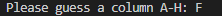
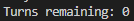

# Battle-Ship Game

The Battle-ship Game is a logic game that most people are familiar with that runs in the command-line interface. It allows a single user to play an opponent (computer) in the game of Battle_ship.

## UX
### Ideal Client
The ideal client for this page is anyone that wants to pass some time in a fun way.
#### They would ideally:
<ul>
    <li>Someone who is impulsive.</li>
    <li>Has some time to spare.</li>
    <li>Is a logical thinker.</li>
    <li>Enjoys making tatical decisions to achieve a desired outcome.</li>
</ul> 

#### Goal as a Game User:
<ul>
    <li>Understand the game.</li>
    <li>Be able to easily operate the game and its functions.</li>
    <li>Be able to see their own score as well as the opponents.</li>
</ul>

## Design
I mapped out what I wanted to achieve with my functions on a flowchart

## Languages Used
The only language used on this project was Python.

## Features

## Existing Features

### Game board display
The game displays both a player board and and opponent board.
<ol>
 <li>
  Player Board
   <ul>
   
    <li>
     The board is made up as a grid with rows labelled 1-8 and columns labelled A-H, This allows the user to see and determine where they want to strike.
    </li>
    <li>
     It displays the position of the users randomly placed ships with the "#" symbol.
    </li>
    <li>
     Shows the user where the opponent has already guessed, misses are displayed with a "-" symbol and hits are displayed with a "X" symbol.
    </li>
   </ul>
 </li>
 <li>
  Opponent Board
 </li>
  <ul>
  
   <li>
    The Opponent board is created in the same way as the player board, the only difference is the random generated ships are hidden from the user.
   </li>
   <li>
    The board shows the user where they have guessed displaying a "-" symbol for a miss and a "X" symbol for a hit.
   </li>
  </ul>
</ol>

### User Inputs
There are 2 user inputs for the game, 1 for row selection and the other for column selection.
<ol>
 <li>
  Row Input
  <ul>
  
   <li>
    When the game is ran a row selection input is printed in the console for the user to type their selection.
   </li>
  </ul>
 </li>
 <li>
  Column Input
  <ul>
  
   <li>
    When the row selection has been made a column selection input is printed in the console for the user to type their selection.
   </li>
  </ul>
 </li>
</ol>
When both selections have been made the game will check to see if it's a hit or miss and the display whuch it is on the opponent board.

### Selection Outcome Display

When the player has made a selection of where to strike the game will display "It's a miss!", "It's a hit!" or "Positioned already guessed!" for both the player and the opponent.

### Hits counters

When the game is ran it will display a hit counter for both the player and the opponent so the player can see who has more hits at any given time during the game.

### Turns Counter

When the game is ran it will display a turns counter, this counter with start at the number of turns a player has and will show how many turns the player has remaining throughout the game.

### End of game message

When a player has used all of there turns a message will be printed to the console stating "Congratulations! You Win!", "You Lose!, Better luck next time." or "It's a Draw, Try again" depending on the outcome of the game.

## Possible Features to be implemented in the future:
<ul>
 <li>
  Allow the user to input grid size.
 </li>
 <li>
  Allow user to input ship sizes.
 </li>
 <li>
  Allow user to input number of turns game runs for.
 </li>
 <li>
  Improve on AI of the computer so the guesses are more logical instead of random.
 </li>
</ul>

## Testing
### Validator Testing
<ul>
 <li>
 <a href="http://pep8online.com/" target="_blank">PEP8 online Validator</a>
 </li>
  <ul>
   <li>
    Validator result
     
    
   </li>
   <li>
    Results show 3 instances where the line was above the 80 character limit, all of these instances are unavoidable and can not be shortened any further.
   </li>
  </ul>
</ul>

## UX Client Goals
### Game User:
<ol>
 <li>
  Understand the game.
   <ul>
    <li>
     On the Game loading, It displays a message outlining which symbol defines which outcome.
    </li>
    <li>
     The boards are then printed to show the user the grid they are guessing on and their own ship locations.
    </li>
   </ul>
 </li>
 <li>
  Be able to easily operate the game and its functions.
  <ul>
   <li>
    User only has to type 2 inputs.
   </li>
  </ul>
 </li>
 <li>
  Be able to see their score as well as the opponents.
  <ul>
   <li>
    The score and turns remaining counters are displayed at the bottom Game print in the console.
   </li>
  </ul>
 </li>
</ol>

## Functionality Testing
<ol>
 <li>
   Running Game in console
    <ul>
     <li>
      Ensure that when the code is ran the correct values (player board, opponent board and relavent print statements) are all print ad expected.
     </li>
     <li>
      Give incorrect inputs to ensure it does not pass them.
       
      
     </li>
     <li>
      Running various inputs to ensure the game gives the correct selection outputs.
       
      
       
      
     </li>
     <li>
      Running game for full amount of turns to ensure end of game message is display and outcomes are displayed correctly.
    </ul>
  </li>